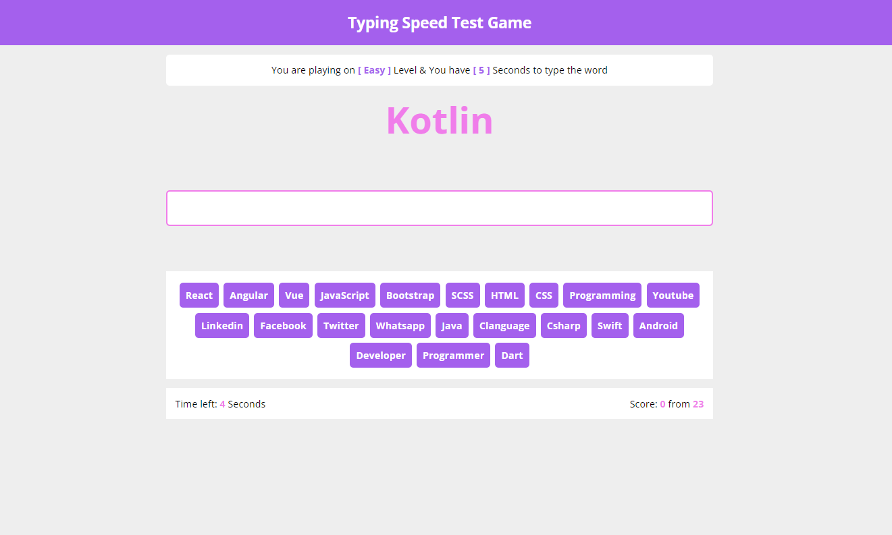

# Frontend Mentor - Typing Speed Test Game

## Welcome! 👋
Thanks for checking out this front-end coding challenge.

## Overview

### The challenge

Users should be able to:

- Write random words to get the final score.
- Get an "Game Over" message when any word typed incorrectly. 

### Links

- Solution URL: [Github](https://github.com/Shaheen121/Typing-Speed-Test-Game.git)
- Live Site URL: [Live Site](https://Shaheen121.github.io/Typing-Speed-Test-Game/)

## My process

### Built with

- Semantic HTML5 markup
- CSS custom properties
- Flexbox
- JavaScript

## Author

- Linkedin - [@aous-shaheen-381636221](https://www.linkedin.com/in/aous-shaheen-381636221/)
- Facebook - [@aoushaheen7](https://www.facebook.com/shaheen7tl/)

By me 🚀🚀🚀
Aous Shaheen